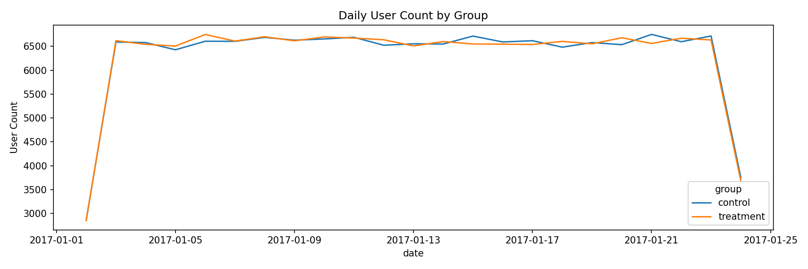
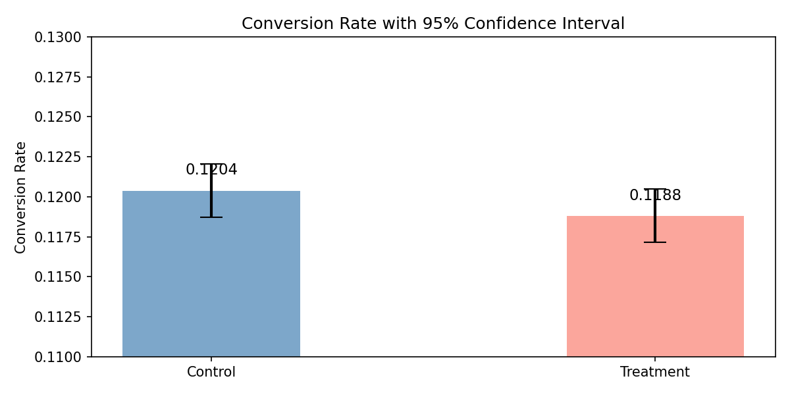
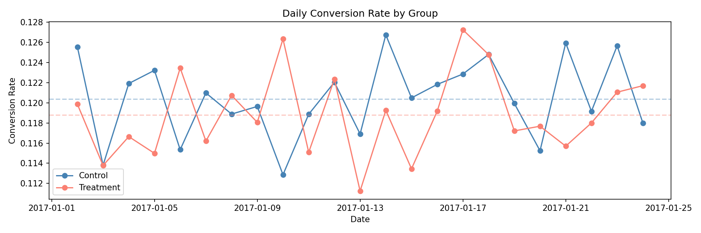
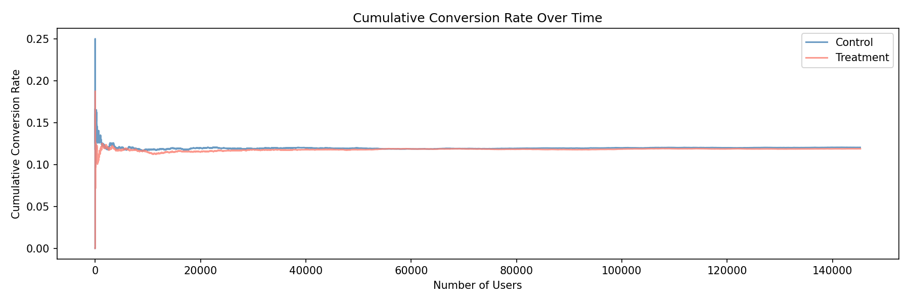
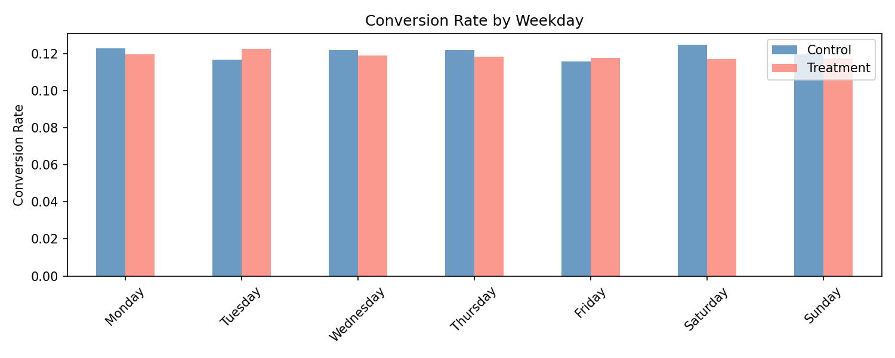
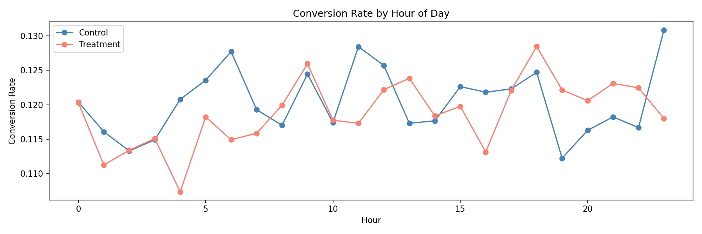

# A/B Test Analysis — E-Commerce Landing Page

## Project Overview
This project conducts a full A/B test analysis on an e-commerce landing page experiment,
going beyond basic significance testing to include validity checks, power analysis, 
and segmentation analysis.

**Dataset:** [A/B Testing Dataset](https://www.kaggle.com/datasets/zhangluyuan/ab-testing) 
— 294,478 records, 5 features
> **Note:** Raw data is not included in this repo due to file size.  
> Download from [Kaggle](https://www.kaggle.com/datasets/zhangluyuan/ab-testing) 
> and place it at `data/raw/ab_data.csv`.

---

## Project Structure

- `data/` — Cleaned dataset
- `notebooks/`
  - `01_EDA.ipynb` — Exploratory data analysis & data cleaning
  - `02_validity_check.ipynb` — SRM detection & power analysis
  - `03_hypothesis_testing.ipynb` — Z-test, confidence intervals, effect size
  - `04_segmentation_analysis.ipynb` — Novelty effect & time-based segmentation
- `figures/` — All exported charts

---

## Key Findings

### Data Cleaning
- Removed 3,894 records with group/page mismatches and duplicate users
- Final dataset: 145,274 control / 145,310 treatment

### Validity Checks

Both groups received a consistent number of users each day throughout the 22-day experiment, confirming no time-based sampling bias.

| Check | Result |
|-------|--------|
| SRM Detection |  No SRM (p = 0.9468) |
| Sample Size |  Sufficient (145K vs required 17K) |
| Time Distribution |  Both groups evenly distributed |

### Hypothesis Testing
| Metric | Control | Treatment |
|--------|---------|-----------|
| Conversion Rate | 12.04% | 11.88% |
| 95% CI | (11.87%, 12.21%) | (11.71%, 12.05%) |
| Relative Change | — | -1.31% |

- **Z-statistic:** -1.3109  
- **P-value:** 0.1899 (> 0.05, not significant)  
- **Cohen's h:** -0.0049 (negligible effect size)

The 95% confidence intervals of both groups overlap heavily, visually confirming that the difference in conversion rate is not statistically significant.
### Segmentation Analysis
- Cumulative conversion rates converged early and remained stable — no novelty effect detected
- No significant treatment effect observed across weekdays or hours of day

Daily conversion rates fluctuate similarly across both groups with no consistent gap, suggesting the new page provides no systematic lift.

Cumulative conversion rates converge early and remain stable throughout the experiment, indicating the result is reliable and no novelty effect is present.

No weekday shows a consistent advantage for the treatment group, ruling out day-of-week as a confounding factor.

Conversion rate trends by hour are largely parallel between groups, with no time window showing a meaningful treatment advantage.

---

## Conclusion
The new landing page does **not** significantly improve conversion rate.  
Recommendation: **Do not launch** the new page. The -1.31% change is statistically 
insignificant (p = 0.19) and practically negligible (Cohen's h ≈ 0).

---

## Methods & Tools
- **Languages:** Python
- **Libraries:** pandas, scipy, statsmodels, matplotlib
- **Statistical Methods:** Two-proportion Z-test, Confidence Intervals, 
  Cohen's h effect size, Chi-square SRM test, Power Analysis

---

## Author
Xin Huang